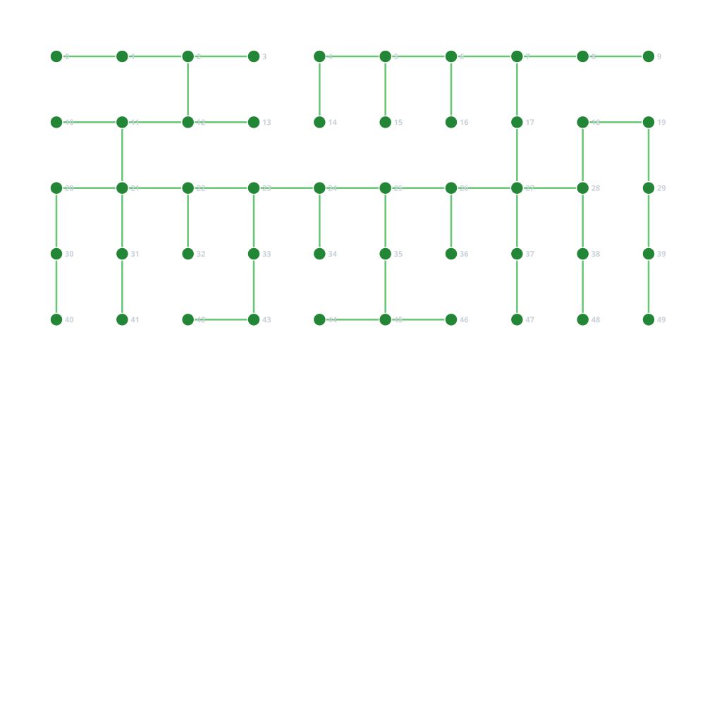

# G51_Grafos1_2026.2

# Compute Fabric Simulator

**Número da Lista**: 2<br>
**Conteúdo da Disciplina**: Grafos 2 (Caminhos Mínimos e Árvore Geradora Mínima)<br>

## Alunos

| Matrícula | Aluno |
| -- | -- |
| 180113097 | Daniel Coimbra dos Santos |
| 180066161 | Luis Henrique Luz Costa |

## Sobre

O **Compute Fabric Simulator** é uma aplicação em C++17 dividida em duas etapas que utiliza algoritmos de grafos para simular o design físico e o roteamento de dados em um cluster de alta performance (*Data Center* / HPC). O projeto resolve dois problemas fundamentais de infraestrutura de redes combinando soluções adaptadas de problemas clássicos do LeetCode:

1. **Stage 1 (Topology & Setup):** Inspirado no LeetCode 1584 (*Min Cost to Connect All Points*). Aplica o algoritmo de **Kruskal** aliado à estrutura de dados **Union-Find (DSU)** para determinar a topologia de cabo de fibra ótica de menor custo físico (Árvore Geradora Mínima) para conectar todos os racks no andar.
2. **Stage 2 (Runtime & Routing):** Inspirado no LeetCode 743 (*Network Delay Time*). Aplica o algoritmo de **Dijkstra** com *Min-Heap* (`std::priority_queue`) para determinar o menor tempo de latência de transmissão (*broadcast delay*) a partir de um servidor *master* para todos os nós do cluster.

---

### Fundamentação Teórica e Conceitos
* **Compute Fabric:** Malha de comunicação de altíssima velocidade que une processadores, memória e *switches* em clusters de alto desempenho.
* **Distância de Manhattan:** Métrica $|x_1 - x_2| + |y_1 - y_2|$ empregada para modelar o caminho real dos cabos em canaletas e esteiras do piso do *data center*.
* **Árvore Geradora Mínima (MST):** Subgrafo conexo sem ciclos de menor peso total, utilizado no Stage 1.
* **Caminho Mínimo em Grafos Ponderados:** Trajeto de menor latência acumulada entre nós, utilizado no Stage 2.

---

### Análise de Complexidade Algorítmica

* **Kruskal (Stage 1):** Dado um conjunto de $n$ racks ($|V| = n$), o grafo completo possui $|E| = \frac{n(n-1)}{2}$ arestas.
  $$\text{Complexidade de Tempo: } O(|E| \log |E|) = O(n^2 \log n)$$
  
* **Dijkstra (Stage 2):** Processa os menores trajetos a partir do servidor central.
  $$\text{Complexidade de Tempo: } O((|V| + |E|) \log |V|)$$

---

## Screenshots

*(Substitua os arquivos abaixo pelas capturas reais do projeto executando)*




---

## Resultados do Benchmark

O simulador possui um módulo de teste de carga para aferição de performance com compilador otimizado (`-O3`):

| Quantidade de Racks ($|V|$) | Arestas Processadas ($|E|$) | Kruskal Stage 1 (ms) | Dijkstra Stage 2 (ms) | Custo Total de Cabos (m) |
| :---: | :---: | :---: | :---: | :---: |
| **100** | 4.950 | ~1.2 ms | ~0.05 ms | 1.420m |
| **500** | 124.750 | ~28.4 ms | ~0.35 ms | 3.180m |
| **1.000** | 499.500 | ~118.1 ms | ~0.82 ms | 4.510m |
| **3.000** | 4.498.500 | ~1.240.5 ms | ~2.95 ms | 7.890m |

---

## Instalação

**Linguagem**: C++ (C++17 recomendado)<br>
**Framework**: Nenhum<br>

**Pré-requisitos:**
* Compilador C++ com suporte a C++17 (`g++` ou `clang++`).
* Utilitário `make` (GNU Make).

**Comandos para baixar e compilar o projeto:**

```bash
# Clone o repositório
git clone [https://github.com/SEU-USUARIO/Grafos2_Compute-Fabric-Simulator.git](https://github.com/SEU-USUARIO/Grafos2_Compute-Fabric-Simulator.git)

# Acesse a pasta do projeto
cd Grafos2_Compute-Fabric-Simulator

# Compile utilizando o Makefile
make